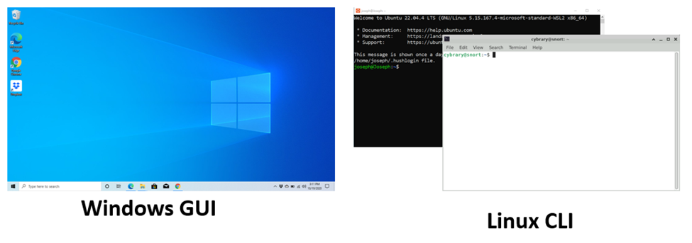

# OPERATING SYSTEM FUNDAMENTALS

## **Learn the Basics of Windows and Linux Operating Systems**

This skill path is designed to give you a solid, general understanding of **Operating System Fundamentals**, specifically in the context of **IT and Cybersecurity Foundations**.

## **Linux CLI Basics**

### **Overview**

**Linux: A Powerful and Widely Used Operating System**

Linux is a **Unix-like operating system** written primarily in the **C programming language**. It was created by **Linus Torvalds** in **1991**, with the initial goal of developing a **free operating system for educational institutions**.

Over time, Linux swiftly gained popularity and became a dominant platform in various fields. **More than 47% of developers** now use Linux as their **primary operating system**. Additionally, **over 49% of the top 100,000 websites** and **40% of all websites** run on Linux.

Its lightweight nature and high efficiency also make it the preferred choice for **over 78% of Internet of Things (IoT) devices**.

Understanding how to **use, configure, and manage Linux** is therefore essential for both **system administrators** and **cybersecurity professionals**.

**GUI vs. CLI**

As a **computer user** and **cybersecurity student**, you are likely already familiar with **Microsoft Windows**. In Windows, the primary way to work with and manage the operating system is through its **Graphical User Interface (GUI)**, where most tasks are **mouse-driven**.

Similarly, **Linux systems** also provide a **graphical user interface**, along with many GUI tools to help manage the system.

However, the **primary method of administering Linux** is through the **Command Line Interface (CLI)**. The Linux CLI is a **text-based interface**, commonly referred to as a **terminal** or **shell**, making most Linux management **keyboard-driven**.

There are various shells available in Linux, but the most popular is **BASH (Bourne Again Shell)**, named after **Steven Bourne**, the creator of the original Unix Bourne shell.



**Why Use the CLI?**

Graphical User Interfaces (GUIs) are **popular and easy to learn**, making them accessible for most users. However, the **Command Line Interface (CLI)** offers its own unique set of **powerful benefits**.

- **Speed and Efficiency:**
    
    CLI administration is often **faster** than navigating through multiple GUI menus or hunting for tools with a mouse.
    
- **Automation through Scripting:**
    
    The CLI makes it easier to **automate repetitive tasks** by creating scripts—combining different commands to perform **more complex functions**.
    
- **Advanced Control:**
    
    When managing a **large command vocabulary**, along with a wide range of **options and arguments**, the CLI can be far **more efficient** than a GUI designed for the same purpose.
    

Taken together, these features make the **CLI a powerful and essential tool**, well worth mastering for anyone in **system administration or cybersecurity**.

**Part 1: Navigation** 

**lesson Overview: Practicing Common BASH Commands**

In this lesson, you will **learn and practice several common commands** for the **BASH shell** on a Linux system.

We will begin by **opening the Terminal** and practicing a set of **basic commands** used to **navigate your Linux workstation**.

> Important Notes:
> 
> - Pay **close attention** to each command and type it **exactly** as it appears in the instructions.
> - You must follow all instructions **precisely** in order to obtain the **flag required to complete the lab**.
> - Be **extra careful** with the **spaces between characters**—even a small mistake can cause the command to fail.
> - If you are unsure about the spacing, use your **cursor to highlight each character** and **verify the spacing**.

**Step 1: Opening the Terminal and Understanding the Prompt**

1. On the Linux desktop, **right-click anywhere** and select **“Open Terminal Here”** from the context menu to open a new terminal window.
2. In the terminal window, you will see a **prompt**, for example:

```bash
cybrary@linux:~/Desktop$

```

or

```bash
cybrary@ip-10.191.20.113:~/Desktop$

```

---

### **Breaking Down the Prompt**

- **cybrary** → This is the **username** you are logged in as.
- **@** → Separates the username from the hostname.
- **linux** or **ip-10-xxx-xxx-xxx** → This is the **hostname** of the machine.
- **:~/Desktop** → Shows your **current directory**.
    - `~` means **home directory** (`/home/cybrary`)
    - `~/Desktop` means **/home/cybrary/Desktop**
- **$** → Indicates you are a **non-root user**. (If it were `#`, it would mean root privileges.)

> Note: Not every Linux terminal will explicitly show all this information.
> 

---


**Step 2: Verify User, Hostname, and Current Directory**

1️⃣ **Check the Current User**

At the prompt, type:

```bash
whoami

```

**Expected Output:**

```bash
cybrary

```

This confirms that you are logged in as the **cybrary** user.

---

2️⃣ **Check the Hostname of the Machine**

At the prompt, type:

```bash
hostname

```

**Expected Output:**

```bash
linux

```

(or it might show something like `ip-10-191-20-113`, matching the hostname displayed in your terminal prompt).

---

3️⃣ **Check the Current Directory**

At the prompt, type:

```bash
pwd

```

**Expected Output:**

```bash
/home/cybrary/Desktop

```

This shows your **full current directory path**.

- `~` is shorthand for the **home directory** (`/home/cybrary`).
- Therefore, `~/Desktop` = `/home/cybrary/Desktop`.

---

**Step 3: View User and Group Information**

At the prompt, type:

```bash
id

```

**Expected Output:**

```bash
uid=1001(cybrary) gid=1001(cybrary) groups=1001(cybrary)

```

- **uid=1001** → This is the **user ID**, showing `cybrary` is a **standard non-root user**.
- **gid=1001** → This is the **group ID**.
- **groups=1001(cybrary)** → The user belongs to a **group with the same name**.

Now that you know **who you are** and **where you are**, let’s explore the Linux file system.

---

**Step 4: Move Up One Directory**

At the prompt, type:

```bash
cd ..

```

> Note: There is a space between cd and ..
> 

This moves you **one level up** in the directory tree:

- From `/home/cybrary/Desktop`
- To `/home/cybrary`

You can confirm with:

```bash
pwd

```

**Expected Output:**

```bash
/home/cybrary

```

---

**Step 5: List Files in the Current Directory**

At the prompt, type:

```bash
ls

```

**Expected Output (example):**

```bash
Desktop  Documents  Downloads  Pictures  Videos

```

This shows a simple list of files and directories in `/home/cybrary`.

---

**Step 6: View a Detailed Directory Listing**

At the prompt, type:

```bash
ls -l

```

**Expected Output (example):**

```bash
drwxr-xr-x  2 cybrary cybrary 4096 Jul 21 09:30 Desktop
drwxr-xr-x  2 cybrary cybrary 4096 Jul 21 09:30 Documents
-rw-r--r--  1 cybrary cybrary  220 Jul 21 09:30 notes.txt

```

---

### **Understanding `ls -l` Output**

- The first character shows **type**:
    - **d** = directory
    - = regular file
- The next **three sets of three characters** show **permissions**:
    - **rwx** = **read, write, execute**
    - **r-x** = **read + execute only**
    - = **permission not granted**

Example:

```
drwxr-xr-x
││││ ││ ││
││││ ││ │└── others (everyone else) → r-x (read + execute only)
││││ ││ └──── group → r-x (read + execute only)
││││ └─────── owner → rwx (read, write, execute)
│││└───────── type → d = directory

```

So for `/home/cybrary/Desktop`:

- **Owner (cybrary)** → can read, write, and execute (**rwx**)
- **Group (cybrary)** → can read and execute (**r-x**)
- **Others** → can read and execute (**r-x**)

---

## Linux File Permissions and Basic File Operations Lab

## 🔐 Easy Explanation of File Permissions in Linux

### What Are File Permissions?

Permissions control **who can do what** with a file or directory in Linux.

### 📦 Three Types of Users

1. **👤 Owner** – Usually the person who created the file.
2. **👥 Group** – A group the file belongs to.
3. **🌍 Others** – Everyone else.

---

### 🔤 Three Types of Permissions

| Permission | Meaning |
| --- | --- |
| **r** | Read – Can view the content (file) or list files (directory) |
| **w** | Write – Can modify the content (file) or add/delete files (directory) |
| **x** | Execute – Can run the file (program/script) or enter a directory |

---

### 📄 Example `ls -l` Output

```bash
drwxr-xr-x  2 cybrary cybrary 4096 Jul 1 10:00 Desktop
-rw-r--r--  1 cybrary cybrary  123 Jul 1 11:00 notes.txt

```

---

### 🔍 Breakdown of Permissions

Take this line for example:

```
drwxr-xr-x

```

- The **first character** indicates the **type**:
    - `d` → directory
    - → file
- The next 9 characters are split into 3 groups of 3, representing **permissions for owner, group, and others**:

| Characters | Applies To | Permissions |
| --- | --- | --- |
| `rwx` | Owner | read, write, execute |
| `r-x` | Group | read, no write, execute |
| `r-x` | Others | read, no write, execute |

**Summary:**

`drwxr-xr-x` means:

- It’s a directory.
- Owner can **read, write, execute**.
- Group can **read, execute**.
- Others can **read, execute**.

---

### 🧠 Easy Way to Remember

Think of it as:

```
[Type][Owner][Group][Others]
d    rwx     r-x    r-x

```

Use the `rwx` pattern for each group.

---

## Part 1: Navigating the Linux File System

---

### 1. Show All Files Including Hidden Files

```bash
ls -la

```

- The `a` option shows **all files**, including hidden files (those starting with a dot `.`).
- Hidden files typically manage terminal settings, command history, and shell configurations.

---

### 2. Go Up Two Directories

```bash
cd ../..

```

- Moves up two directory levels.
- Notice your prompt changes, for example, to:

```
cybrary@linux:/$

```

- `/` indicates the **root directory**, the top of the Linux file system.
- You cannot move higher than root.

---

### 3. List Files in Root Directory

```bash
ls

```

- Displays the typical Linux file structure.

---

### 4. Return to Home Directory

```bash
cd ~

```

or

```bash
cd /home/cybrary

```

---

# Part 2: File and Directory Operations

---

### 1. Create a Directory Called `labwork`

```bash
mkdir labwork

```

- Creates a new directory inside your home directory.
- Confirm with:

```bash
ls

```

---

### 2. Navigate to `labwork` Directory

```bash
cd labwork

```

---

### 3. Create Three Empty Files

```bash
touch file1.txt file2.txt file3.txt

```

- Creates empty files.
- Confirm with:

```bash
ls

```

---

### 4. Append Text to `file1.txt`

```bash
echo "This is file 1" >> file1.txt

```

- `>>` appends text to the file (adds without overwriting).
- Note: `>` overwrites the file content.

---

### 5. View Contents of `file1.txt`

```bash
cat file1.txt

```

---

### 6. Check File Type of `file1.txt`

```bash
file file1.txt

```

- Confirms it’s an ASCII text file.

---

### 7. Append Text to `file2.txt` and `file3.txt`

```bash
echo "This is file 2" >> file2.txt
echo "This is file 3" >> file3.txt

```

- Confirm with:

```bash
cat file2.txt file3.txt

```

---

### 8. Create Three Directories: `red`, `blue`, `green`

```bash
mkdir red blue green

```

- Confirm with:

```bash
ls

```

---

### 9. Copy `file1.txt` to `blue` Directory

```bash
cp file1.txt blue/

```

---

### 10. Recursively List All Files and Folders in `labwork`

```bash
ls -R

```

- Notice `file1.txt` appears in both the `labwork` and `blue` directories.

---

### 11. Remove `file1.txt` with Confirmation

```bash
rm -i file1.txt

```

- Type `y` when prompted.
- Using `i` avoids accidental deletion.

---

### 12. Confirm `file1.txt` Removal

```bash
ls -R

```

---

### 13. Move `file2.txt` to `green` Directory

```bash
mv file2.txt green

```

- Confirm `file2.txt` exists **only** in `green` with:

```bash
ls -R

```

---

### 14. Rename `file3.txt` to `happypumpkin.moo`

```bash
mv file3.txt happypumpkin.moo

```

- Confirm change with:

```bash
ls

```

---

### 15. Confirm Content of Renamed File

```bash
cat happypumpkin.moo

```

---

### 16. Move and Rename File to `red/file3.txt`

```bash
mv happypumpkin.moo red/file3.txt

```

- Confirm with:

```bash
ls -R

```

---

### 17. Create a Large File (`abigfile.txt`)

```bash
base64 /dev/urandom | head -c 1M > abigfile.txt

```

- Creates a 1MB file of random printable characters.

---

### 18. Confirm Creation of `abigfile.txt`

```bash
ls -la

```

---

### 19. View Large File Using `more`

```bash
more abigfile.txt

```

- Scroll down one line with `Enter`, one page with space bar.
- Quit with `q`.

---

### 20. View Large File Using `less`

```bash
less abigfile.txt

```

- Scroll forward/backward using arrow keys or `Enter`/`b`.
- Quit with `q`.

---

# Searching for Files and Text

---

### 21. Find Files Named "more" Starting at Root

```bash
find / -name "more" 2>/dev/null

```

- Suppresses errors with `2>/dev/null`.

---

### 22. Find `.txt` Files in Current Directory and Subdirectories

```bash
find . -name "*.txt"

```

---

### 23. Search Recursively for Text "This"

```bash
grep -r "This" .

```

---

# Basic File Parsing and Counting

---

### 24. Return to Home Directory

```bash
cd ~

```

---

### 25. View Contents of File `unsorted`

```bash
cat unsorted

```

---

### 26. Sort Contents Alphabetically

```bash
cat unsorted | sort

```

---

### 27. Sort and Remove Duplicates

```bash
cat unsorted | sort | uniq

```

---

### 28. Count Words, Lines, and Characters

```bash
cat unsorted | wc

```

---

### 29. Count Words Only

```bash
cat unsorted | wc -w

```

---

### 30. Count Lines in Sorted Unique List

```bash
cat unsorted | sort | uniq | wc -l

```

---

## Combining Commands with Pipes, `grep`, and `wc`

---

### 31. Change Directory to `/home/cybrary`

```bash
cd ~

```

---

### 32. List Files with Ownership Information

```bash
ls -l

```

---

### 33. Filter Files Owned by `cybrary`

```bash
ls -l | grep "cybrary cybrary"

```

---

### 34. Count Files Owned by `cybrary`

```bash
ls -l | grep "cybrary cybrary" | wc -l

```

---

### 35. Return to Desktop Directory

```bash
cd ~/Desktop

```

---

### 36. Run the Flag Script

```bash
./flag.sh

```

- You will need 8 points to reveal the flag and complete the lab.

# Summary

In this lesson, you learned how to:

- Navigate the Linux file system
- Find files and folders
- Create, rename, move, copy, and remove files and directories
- Append and view file contents
- Use pipes to combine commands
- Search for files and text
- Count lines, words, and characters in files
- Understand and interpret Linux file permissions

---

## 1️⃣ **What is a File System? (Simple Explanation)**

- Your **Operating System (OS)** needs a way to **store and organize data** on hard drives (HDD/SSD).
- A **File System** is like a **big library catalog**:
    - It keeps **metadata** (info about files like size, owner, permissions)
    - It knows **where your files are physically stored**
- In Linux, everything is treated as a **file**:
    - A text file is a file ✅
    - A folder is a special type of file ✅
    - A device (keyboard, USB, disk) is also represented as a **file in `/dev`** ✅

In **Windows**, you see drives like `C:`, `D:`. In **Linux**, you have **just one root (`/`)** and everything lives under it.

---

## 2️⃣ **Linux Filesystem Hierarchy Standard (FHS)**

👉 **Root `/` is the TOP of the Linux filesystem.**

Everything else is **inside it**.


Here are **important directories** with **meaning + example**:

| Directory | Purpose | Example |
| --- | --- | --- |
| `/` | Root (everything starts here) | `cd /` brings you to top level |
| `/bin` | Basic commands for all users | `ls`, `cat`, `cp`, `mv` |
| `/boot` | Boot files like the Linux kernel | `vmlinuz`, `initrd` |
| `/dev` | Devices appear as files | `/dev/sda`, `/dev/null` |
| `/etc` | Configuration files | `/etc/hosts`, `/etc/fstab` |
| `/home` | User home folders | `/home/raja` |
| `/lib` | Shared libraries for programs | `libc.so` |
| `/media` | Mount point for USB/CD-ROM | `/media/usb1` |
| `/mnt` | Temporary mount point | `/mnt/data` |
| `/opt` | Optional software | `/opt/oracle` |
| `/proc` | Virtual FS for processes | `/proc/1234` |
| `/root` | Root user’s home | `/root` |
| `/run` | Runtime system info | `/run/utmp` |
| `/sbin` | System binaries for admin | `fsck`, `iptables` |
| `/srv` | Service data | `/srv/www` |
| `/sys` | Info about hardware/kernel | `/sys/devices` |
| `/tmp` | Temporary files | `/tmp/file.tmp` |
| `/usr` | User apps & binaries | `/usr/bin/firefox` |
| `/var` | Variable files (logs, cache) | `/var/log/syslog` |

---

## 3️⃣ **Step-by-Step Hands-On Practice**

We’ll go step by step so you can **see the structure and understand each part**.

---

### 🔹 **Step 1: Go to the Root Directory**

```bash
cd /
pwd

```

✅ You should see `/`

✅ You are now at the **top** of Linux filesystem

---

### 🔹 **Step 2: List Directories in Root**

```bash
ls -l /

```

You’ll see something like:

```
drwxr-xr-x   2 root root 4096 boot
lrwxrwxrwx   1 root root    7 bin -> usr/bin
drwxr-xr-x   3 root root 4096 dev
...

```

✅ `d` → it’s a **directory**

✅ `l` → it’s a **link** (like a Windows shortcut)

✅ `rwxr-xr-x` → permissions

---

### 🔹 **Step 3: See Tree View (Optional)**

```bash
sudo apt install tree -y    # install if needed
tree / -L 1

```

✅ Shows a **tree-like** structure one level deep.

Try deeper levels:

```bash
tree / -L 2

```

---

### 🔹 **Step 4: Explore `/home`**

```bash
cd /home
ls -l

```

✅ You’ll see user folders like:

```
drwxr-x--- 5 raja raja 4096 Jan 01 12:00 raja

```

👉 **raja** is the **owner** of their home folder

👉 Other users **can’t write** inside it

---

### 🔹 **Step 5: See Devices in `/dev`**

```bash
ls /dev | head

```

You’ll see things like:

```
null   random   sda   tty0   urandom

```

✅ `/dev/null` → black hole (anything written here disappears)

✅ `/dev/sda` → your hard disk

---

### 🔹 **Step 6: View Processes in `/proc`**

```bash
ls /proc | head

```

You’ll see **numbers** – those are **process IDs (PIDs)**.

For example:

```
1  7  89  132  500

```

✅ Each PID has a folder with info about that process.

---

### 🔹 **Step 7: Explore Logs in `/var/log`**

```bash
ls /var/log

```

You’ll see:

```
auth.log  syslog  kern.log  lastlog  dmesg

```

View logs:

```bash
sudo tail -f /var/log/syslog

```

✅ Shows **live system messages**. Press **CTRL+C** to stop.

---

### 🔹 **Step 8: Check Disk Info**

```bash
sudo fdisk -l | grep dev | grep -v loop

```

✅ Lists your disks like `/dev/sda`

Then:

```bash
sudo df -h

```

✅ Shows disk usage in **human-readable format**

---

### 🔹 **Step 9: See `/boot`**

```bash
ls /boot

```

✅ Contains Linux **kernel** and bootloader files like `vmlinuz`, `initrd.img`

---

### 🔹 **Step 10: Add a New User (Optional)**

```bash
sudo adduser michael

```

✅ Creates `/home/michael`

✅ Then check:

```bash
ls /home

```

---

### 🔹 **Step 11: Find Files**

```bash
find / -name "*.conf" 2>/dev/null

```

✅ Finds all `.conf` files

Search for text inside files:

```bash
grep -r "password" /etc/

```

✅ Searches for the word “password” in `/etc/`

---

## 4️⃣ **Special Notes**

- **Symbolic links**:
    
    `/bin → /usr/bin` (backward compatibility)
    
- **Permissions**:
    
    `rwxr-xr-x` = owner has full, others have read/execute only
    
- **Everything is a file** (even USB, RAM, network)

---

## 5️⃣ **Windows vs Linux** Quick Comparison

| Linux | Windows |
| --- | --- |
| `/` root | `C:\` root drive |
| `/home/user` | `C:\Users\user` |
| `/etc` configs | Windows Registry + `.ini` files |
| `/dev/sda` device | `Disk 0` in Windows |
| `/var/log/syslog` logs | `Event Viewer` |
| CLI = bash/zsh | CLI = CMD / PowerShell |

---

# ✅ Windows CLI Basics

Windows has **two main command environments**:

1️⃣ **Command Prompt (cmd.exe)** → Old-school DOS-like commands

2️⃣ **PowerShell** → Modern, powerful scripting shell

💡 **You can run CMD commands inside PowerShell**, but sometimes PowerShell interprets things differently. So, if you want a *pure CMD experience*, you can drop into `cmd` mode **from PowerShell**.

---

## 📌 **Part 1: Navigation Commands**

---

### **Step 1: Open PowerShell as Admin**

- **Right-click Start → Windows PowerShell (Admin)**
- Click **Yes** if prompted by UAC
- You’ll see something like:
    
    ```
    PS C:\Windows\System32>
    
    ```
    

---

### **Step 2: Switch to CMD inside PowerShell**

```powershell
cmd

```

✅ Now you’re in a **classic Windows CLI**

Prompt changes to something like:

```
C:\Windows\System32>

```

---

### **Step 3: See your current user**

```
whoami

```

Expected output:

```
COMPUTERNAME\yourusername

```

💡 Useful for checking if you’re running as Admin or a normal user.

---

### **Step 4: Go to your Home Directory**

```
cd %HOMEPATH%

```

✅ `%HOMEPATH%` is an **environment variable** for your user profile.

Now prompt will look like:

```
C:\Users\YourName>

```

---

### **Step 5: List files**

```
dir

```

✅ Shows files/folders in current directory:

```
 Volume in drive C has no label.
 Directory of C:\Users\YourName

01/21/2025  10:00 AM    <DIR>          Documents
01/21/2025  10:00 AM    <DIR>          Downloads
               0 File(s)              0 bytes

```

---

### **Step 6: See more directory details**

```
dir /S /P

```

- `/S` → list all files in **subfolders**
- `/P` → pause after each screen

✅ Press **any key** to see more, **CTRL+C** to stop.

---

### **Step 7: Learn about `dir`**

```
help dir

```

✅ Shows all available switches like `/A`, `/B`, `/O`, etc.

💡 **Try:**

```
dir /B   → Bare format (just filenames)
dir /A:D → Only directories
dir /A:-D → Only files

```

---

### **Step 8: View a tree structure**

```
tree

```

✅ Shows a **graphical folder structure**

Example:

```
C:.
├── Documents
│   ├── Work
│   └── Personal
└── Downloads

```

## 📌 **Part 2: File Operations**

Now let’s manipulate some files/folders.

### **Step 1: Create multiple folders**

```
mkdir apple1 apple2 apple3

```

✅ Creates **3 folders at once** in your current directory.

Check them:

```
dir apple*

```

Output:

```
 Directory of C:\Users\YourName

01/21/2025  10:10 AM    <DIR>          apple1
01/21/2025  10:10 AM    <DIR>          apple2
01/21/2025  10:10 AM    <DIR>          apple3

```

---

### **Step 2: Create a text file with `echo`**

```
echo The cow says moo. > apple1\cow.txt

```

✅ Creates a **file** named `cow.txt` in `apple1` with the text:

```
The cow says moo.

```

Check it:

```
dir apple1

```

Output:

```
01/21/2025  10:11 AM                 20 cow.txt

```

---

### **Step 3: View the file contents**

```
type apple1\cow.txt

```

✅ Output:

```
The cow says moo.

```

---

### **Step 4: Append contents to another file**

```
type apple1\cow.txt >> apple3\manycows.txt
type apple1\cow.txt >> apple3\manycows.txt
type apple1\cow.txt >> apple3\manycows.txt

```

✅ Now `manycows.txt` contains the line **3 times**

Check it:

```
type apple3\manycows.txt

```

Output:

```
The cow says moo.
The cow says moo.
The cow says moo.

```

💡 **Note:**

- `>` → overwrite file
- `>>` → append to file

---

### **Step 5: Copy files**

```
copy apple1\cow.txt apple2\notacow.txt

```

✅ Makes a copy in `apple2` named `notacow.txt`

Check:

```
type apple2\notacow.txt

```

---

### **Step 6: Search for files with `findstr`**

```
dir /s /b | findstr apple | findstr .txt

```

✅ Finds all `.txt` files in folders containing “apple”

Breakdown:

- `dir /s /b` → list all files (bare format)
- `| findstr apple` → filter results with “apple”
- `| findstr .txt` → further filter for `.txt` files

---

### **Step 7: Count the matching files**

```
dir /s /b | findstr apple | findstr .txt | find /c ".txt"

```

✅ Gives a **number** of `.txt` files in apple folders.

---

### **Step 8: Rename files**

```
rename apple2\notacow.txt reallyacow.txt

```

Check again:

```
dir /s /b | findstr apple | findstr .txt

```

---

### **Step 9: Move files**

```
move apple3\manycows.txt apple2

```

✅ Moves `manycows.txt` from `apple3` → `apple2`

---

### **Step 10: Copy it back**

```
copy apple2\manycows.txt apple3

```

✅ Now `manycows.txt` exists in **both folders**

---

### **Step 11: Delete files**

```
del apple2\manycows.txt

```

✅ **Deletes permanently** (not sent to Recycle Bin)

💡 Safer way:

```
del /p apple2\manycows.txt

```

It will **ask for confirmation**.

---

### **Step 12: Create nested folders**

```
mkdir one\two\three

```

✅ Creates a folder tree:

```
one
└── two
    └── three

```

Check it:

```
tree one

```

---

### **Step 13: Remove folders**

```
rmdir one

```

❌ Won’t work → folder not empty

So use:

```
rmdir /s one

```

✅ Removes folder **and all subfolders**

It will ask:

```
Are you sure (Y/N)? Y

```

---

### **Step 14: View command history**

```
doskey /history

```

✅ Shows all commands used in this session.

💡 **Important:** This history **disappears when you close CMD**.

PowerShell **remembers history even after reboot**.

---

## ✅ Quick Comparison with Linux

| Windows CMD | Linux |
| --- | --- |
| `dir` | `ls` |
| `type file.txt` | `cat file.txt` |
| `mkdir folder` | `mkdir folder` |
| `copy file1 file2` | `cp file1 file2` |
| `move` | `mv` |
| `del` | `rm` |
| `rmdir` | `rmdir` |
| `findstr` | `grep` |
| `echo text > file` | `echo text > file` |

---

## ✅ **Part 3: System Administration - Quick Reference**

These commands help you **inspect, manage, and troubleshoot Windows systems**.

### 🖥 **System Info & Processes**

- `systeminfo` → Shows OS version, hardware, and patch info.
- `tasklist` → Shows all running processes.
- `tasklist /v` → Shows extra details about running processes.

### 📅 **Date & Time**

- `date /t` → Show current date.
- `time /t` → Show current time.
- `date` or `time` → Change system date/time (press Enter to keep current).

### ⚙ **Services**

- `sc query | more` → Shows all running services/drivers (press Space for next page).
- `sc query wscsvc` → Shows the status of **Security Center** service.

### 🌐 **Network & Shares**

- `net` → Shows all available net commands.
- `net share` → Lists shared folders (C$, IPC$, ADMIN$).
- `net user` → Lists all local users.
- `net help user` → Shows help for managing users.
- `net localgroup` → Lists all local groups.
- `net accounts` → Shows password policies.

✅ **Counting examples**

- `net user | find /c /v ""` → Counts *lines* of output, not exact users.
- `net localgroup | find /c "*"` → Counts groups.
- `net share | find /c "$"` → Counts hidden admin shares.

### 🌐 **Networking**

- `ipconfig` → Shows IP, subnet, and gateway.
- **Ping sweep** (replace `x.y.z` with first 3 octets):
    
    ```
    for /L %a in (1,1,255) do @ping -n 1 -w 10 x.y.z.%a > null && echo x.y.z.%a is up!
    
    ```
    
- `ping 8.8.8.8` → Test Google DNS.
- `nslookup www.moo.com 8.8.8.8` → DNS lookup via Google DNS.
- `netstat -ant` → Shows active TCP/UDP connections.

---

## ✅ **Windows File System Basics**

### 📂 **Key Windows Folders**

- **EFI** → Boot files (e.g. `BCD` boot config).
- **PerfLogs** → Performance monitor logs.
- **Program Files** / **Program Files (x86)** → Installed apps (64-bit vs 32-bit).
- **ProgramData** → Non-user-specific app data.
- **Users** → User profiles.
- **Windows** → Core OS files.

🔹 **Hidden Folders**

- `AppData` (user-specific configs).
- `ProgramData` (system-wide configs).

---

### 🚀 **Startup Folder**

- Path: `C:\Users\Cybrary\AppData\Roaming\Microsoft\Windows\Start Menu\Programs\Startup`
- Anything here runs **at login** for that user.
- Shortcut: `shell:startup` (Run dialog).

**Test:**

Create `test.bat` in Startup folder → It appears in **Startup Apps**.

---

### 🔑 **Registry & SAM Database**

- Path: `C:\Windows\System32\config\`
- Important files:
    - **SAM** → Stores user credentials (only OS can read while running).
    - **SECURITY, SOFTWARE, SYSTEM** → Registry hives.
- Open Registry Editor: `regedit`
- Registry hives shown under: `HKEY_LOCAL_MACHINE`

---

### 📜 **Event Viewer & Logs**

- Logs stored in `%SystemRoot%\System32\winevt\Logs\`
- `.evtx` → Proprietary Windows log format.
- Open logs: **Event Viewer** → Windows Logs → Application/Security/System.

---

### ⚙ **System32 Folder**

- `C:\Windows\System32` → Contains `.dll` & `.exe` system tools.
- Examples: `cmd.exe`, `netstat.exe`, `mspaint.exe`, etc.

---

### 🌐 **PATH Environment Variable**

- Shows where Windows looks for executables.
- Check it:
    
    ```
    echo %PATH%
    
    ```
    
- Edit it: `sysdm.cpl` → Advanced → Environment Variables.

---

### 🖥 **Alternate Data Streams (ADS)**

Hide data inside a file:

```
echo This is not a secret. > notasecret.txt
echo SecretPassword123 > notasecret.txt:secret

```

✅ Check streams in PowerShell:

```powershell
Get-Item .\notasecret.txt -Stream *
Get-Content .\notasecret.txt -Stream secret

```

---

### 📖 **Hosts File**

- Path: `C:\Windows\System32\drivers\etc\hosts`
- Maps hostnames → IPs (overrides DNS).
- Hackers can edit this to redirect sites.

---

### 🖼 **Default Apps**

- Settings → Default Apps → **Choose by file type**
- Find default app for `.gif`, `.txt`, etc.

---

### 🌐 **Different Paths, Same Place**

- **Desktop** can appear as:
    - `C:\Users\cybrary\Desktop`
    - `This PC > Desktop`
        
        → Same location, different references.
        

---

## ✅ **Key Challenge Commands**

You might be asked to:

1. **Create directories/files**
    
    ```
    mkdir Blue\Red\Green
    echo hello > Blue\file1.txt
    echo hi > Blue\Red\file2.txt
    echo hey > Blue\Red\Green\file3.txt
    
    ```
    
2. **Search text in files**
    
    ```
    findstr "POPCORN" C:\Users\cybrary\Desktop\Popcorn\*.*
    
    ```
    
3. **Find network shares**
    
    ```
    net share
    
    ```
    

---

## ✅ **Essential Takeaways**

- `sc`, `net`, `ipconfig`, `ping`, `nslookup`, `netstat` → Admin & networking basics.
- **Startup folder** auto-runs scripts.
- **SAM & Registry** → Sensitive config & credentials.
- **Event Viewer logs** → Stored as `.evtx`.
- **System32** → Core OS tools.
- **PATH variable** → Controls where Windows looks for executables.
- **ADS** can hide secrets.
- **Hosts file** overrides DNS.
- **Different UI paths → same actual folder**.

---

## ✅ **1. Windows Services – Quick Overview**

- **What are Windows Services?**
    - Special programs that run **silently in the background**, usually starting at boot.
    - Run in **Session 0** (separate from logged-in users).
    - Often use **Local System Account** (high privilege), but best practice is to run with a **dedicated low-privilege account**.
- **Service Types**
    - **Win32OwnProcess** → runs as a separate EXE.
    - **Win32ShareProcess** → runs inside a **shared svchost.exe**.
- **Startup Types**
    - **Automatic** → starts on boot.
    - **Automatic (Delayed)** → starts after boot (for better performance).
    - **Manual** → only starts when required.
    - **Disabled** → never starts.
- **Key Control Tools**
    - **Service Control Manager (SCM)** → GUI tool (`services.msc`).
    - **PowerShell** → `Get-Service`, `Start-Service`, etc.
    - **WMIC** → query detailed service info, including paths.

---

## ✅ **2. Common & Important Windows Services**

| **Display Name** | **Service Name** | **Purpose** |
| --- | --- | --- |
| Windows Update | `wuauserv` | Installs updates/patches |
| Print Spooler | `spooler` | Manages print jobs |
| Windows Defender AV | `WinDefend` | Malware protection |
| Background Intelligent Transfer | `BITS` | Background file downloads |
| Cryptographic Services | `CryptSvc` | Encryption/certificates |
| Windows Audio | `Audiosrv` | Manages sound |
| Task Scheduler | `Schedule` | Runs scheduled tasks |
| Remote Desktop Services | `TermService` | Remote desktop sessions |
| Windows Time | `w32time` | Time sync |
| Windows Firewall | `MpsSvc` | Controls network traffic |
| RPC | `RpcSs` | Inter-process communication |

---

## ✅ **3. Windows Services as Attack Vectors**

Since many services run with **high privileges**, attackers target them by:

1. **Unquoted Service Path Attack**
    - If service path has spaces & no quotes → Windows might execute the wrong file.
    - Example:
        
        ```
        Service path: C:\Program Files\My Service\service.exe
        
        ```
        
        Windows might check:
        
        - `C:\Program.exe`
        - `C:\Program Files\My.exe`
        - `C:\Program Files\My Service\service.exe`
            
            → Attacker can place a malicious `C:\Program.exe`.
            
2. **User-Writable Service Path Attack**
    - If folder is writable → attacker replaces the legitimate EXE.
3. **User-Modifiable Service Attack**
    - If attacker can change service configuration → they can point it to a malicious binary.

> ⚠️ Realistic?
> 
> 
> Not trivial, needs:
> 
- Write permissions
- Ability to restart service
- System reboot or trick admin

---

## ✅ **4. Hands-On Exploration**

### 🖥 **Part 1 – Explore Services with SCM**

1. **Open SCM**
    - Search `services` → open **Services Desktop App**.
2. **Check Tabs & Sorting**
    - Sort by **Status** → Running/Stopped.
    - Sort by **Startup Type** → Look for **Automatic but not running**.
3. **Check Service Properties**
    - **General Tab** → Service name, executable path.
    - **Log On Tab** → Which account it runs under.
    - **Recovery Tab** → What happens if service fails.
    - **Dependencies Tab** → Required services.
4. **Remote Management**
    - Right-click → *Connect to another computer* → manage remote services.

---

### 💻 **Part 2 – Explore Services with PowerShell**

1. **Open PowerShell (Admin)**
    - `Get-Service` → shows **Status, Name, DisplayName**.
2. **Filter Running Services**
    - `Get-Service | Where-Object Status -EQ "Running"`
3. **Filter Non-Running Services**
    - `Get-Service | Where-Object Status -NE "Running"`
4. **Show All Properties**
    - `Get-Service | Select-Object * | Format-Table`
5. **Use WMIC for Executable Paths**
    - `wmic service get name,pathname`
    - `wmic service where Started=True get name,pathname`

---

### 🔥 **Part 3 – Unquoted Service Path Exploit**

1. **Detect Unquoted Paths**
    
    ```
    wmic service get name,pathname,startmode | findstr /i "auto" | findstr /i /v "c:\windows\\" | findstr /i /v """
    
    ```
    
    → Finds vulnerable services.
    
2. **Create a Vulnerable Service**
    
    ```powershell
    mkdir "C:\Program Files\my service"
    copy WindowsService1.exe "C:\Program Files\my service"
    New-Service -Name MyService -BinaryPathName "C:\Program Files\my service\WindowsService1.exe"
    
    ```
    
    → Creates an unquoted path service.
    
3. **Start & Check Logs**
    
    ```powershell
    Start-Service MyService
    eventvwr.msc → Windows Logs → Application
    
    ```
    
4. **Exploit**
    - Copy malicious EXE:
        
        ```powershell
        copy EvilWindowsService.exe C:\Program.exe
        
        ```
        
    - Restart service:
        
        ```powershell
        Stop-Service MyService
        Start-Service MyService
        
        ```
        
    - Event Viewer → now shows malicious log entry.

---

## ✅ **5. Key Takeaways**

- Services are **essential background processes** with powerful privileges.
- Misconfigured services (like **unquoted paths**) can lead to **privilege escalation**.
- Always:
    - Use **quoted paths**.
    - Restrict folder **write permissions**.
    - Use **least privilege accounts**.

---

## ✅ 1. What is Active Directory (AD)?

Think of **Active Directory** as the **company’s brain** – it stores everything about your network:

- **Who** you are (users)
- **What** you use (computers, printers)
- **What you’re allowed to do** (permissions)

It provides:

- **Centralized management** (control everything from one place)
- **Authentication** (logins, Single Sign-On)
- **Authorization** (who can access what)

---

## ✅ 2. Active Directory Structure (Simple Tree 🌳)


```

[Forest: company.com]
   |
   └── [Domain: sales.company.com]
           ├── OU: HR
           │      ├── Users (HR staff)
           │      └── Groups (HR policies)
           ├── OU: IT
           │      ├── Users (IT admins)
           │      └── Groups (IT security)
           └── Domain Controllers (servers running AD)

```

- **Forest** → Top-level container (company.com)
- **Domain** → Logical boundary (sales.company.com, hr.company.com)
- **Organizational Units (OUs)** → Folders inside a domain (HR, IT)
- **Objects** → Users, Computers, Groups
- **Domain Controllers** → Special servers that store AD database & authenticate users

---

## ✅ 3. Key Supporting Tech

- **DNS** → Critical for AD (helps clients find Domain Controllers)
- **LDAP/Kerberos** → Protocols for authentication
- **Group Policy (GPO)** → Applies security & config settings

---

## ✅ 4. Why Two Domain Controllers in the Lab?

We create:

- **superfriends.local** → Heroes Domain (via GUI)
- **legionofdoom.local** → Villains Domain (via PowerShell)

This teaches:

- GUI-based AD setup
- PowerShell-based AD setup

---

## ✅ 5. Lab Flow (High-Level)

1️⃣ **Create a Domain Controller (DC)**

- GUI method → **superfriends.local**
- PowerShell method → **legionofdoom.local**

2️⃣ **Create Organizational Units (OUs)**

- GUI → Hall of Justice (for Heroes)
- PowerShell → Hall of Doom (for Villains)

3️⃣ **Create Users**

- GUI → Bruce Wayne (in Heroes OU)
- PowerShell → Lex Luthor (in Villains OU)

4️⃣ **Create Groups**

- GUI → Heroes group & add Bruce
- PowerShell → Villains group & add Lex

5️⃣ **Confirm with ADUC & PowerShell**

---

## ✅ 6. Quick Visual of What You’ll Build

```
[Forest: superfriends.local] (GUI)
 └── OU: Hall of Justice
       ├── User: Bruce Wayne
       └── Group: Heroes (Bruce is a member)

[Forest: legionofdoom.local] (PowerShell)
 └── OU: Hall of Doom
       ├── User: Lex Luthor
       └── Group: Villains (Lex is a member)

```

---

## ✅ 7. Step-by-Step Flow

### 🔹 Part 1: GUI – Create **superfriends.local**

1. Open **Server Manager → Add Roles & Features**
2. Select **Active Directory Domain Services**
3. After install → Click **Promote this server**
4. Choose **Add new forest → superfriends.local**
5. Set **DSRM password: P@ssw0rd!**
6. Reboot → Open **dsa.msc** → See ADUC with new domain

---

### 🔹 Part 2: PowerShell – Create **legionofdoom.local**

1. Open PowerShell (Admin)
2. Run:
    
    ```powershell
    Install-WindowsFeature AD-Domain-Services -IncludeManagementTools
    
    ```
    
3. Then:
    
    ```powershell
    Install-ADDSForest -DomainName "legionofdoom.local" -DomainNetbiosName "LEGIONOFDOOM" -ForestMode 7 -DomainMode 7 -InstallDNS -Force
    
    ```
    
4. Enter **P@ssw0rd!**
5. Reboot → Run `Get-ADDomain` to confirm

---

### 🔹 Part 3: Create OUs

- **GUI (Heroes)**
    - In ADUC → Right-click **superfriends.local → New → OU → Hall of Justice**
- **PowerShell (Villains)**
    
    ```powershell
    New-ADOrganizationalUnit -Name "Hall of Doom" -Path "DC=legionofdoom,DC=local"
    
    ```
    

---

### 🔹 Part 4: Create Users

- **GUI (Bruce Wayne)**
    - ADUC → Right-click **Hall of Justice → New → User → bruce.wayne → P@ssw0rd!**
- **PowerShell (Lex Luthor)**
    
    ```powershell
    New-ADUser -Name "Lex Luthor" -SamAccountName "lex.luthor" -UserPrincipalName "lex.luthor@legionofdoom.local" -Path "OU=Hall of Doom,DC=legionofdoom,DC=local" -AccountPassword (Read-Host -AsSecureString "Input Password") -Enabled $true
    
    ```
    

---

### 🔹 Part 5: Create Groups & Add Users

- **GUI (Heroes)**
    - ADUC → Right-click **Hall of Justice → New → Group → Heroes → Add Bruce Wayne**
- **PowerShell (Villains)**
    
    ```powershell
    New-ADGroup -Name "Villains" -GroupScope Global -GroupCategory Security -Path "OU=Hall of Doom,DC=legionofdoom,DC=local"
    Add-ADGroupMember -Identity "Villains" -Members lex.luthor
    
    ```
    

---

## ✅ **What is Group Policy?**

Think of **Group Policy** as a **remote control for all Windows computers in a network**.

It lets admins:

- Set rules for users & computers
- Enforce security & configurations
- Make all systems consistent

Before Group Policy, admins had to manually tweak registry settings. Now it’s **centralized & automated**.

---

## ✅ **How Group Policy Works**

- **Group Policy Objects (GPOs)** → Collections of settings.
- Stored in **two places**:
    - **SYSVOL folder on Domain Controllers** → Contains templates & scripts.
    - **Active Directory** → Links the GPO to users/computers.

So, when a **user logs in** or a **computer starts**, AD checks which GPOs apply.

---


✅ **GPO Processing Order (Hierarchy)**

When policies conflict, **last applied wins**:

1️⃣ **Local GPO** → First applied (lowest priority).

2️⃣ **Site GPO** → Applied next, overrides Local.

3️⃣ **Domain GPO** → Overrides Site.

4️⃣ **OU GPO** → Last applied, **highest priority**.

👉 **Exception:** Password policies always follow **Default Domain Policy**.

---

✅ **Managing Group Policy**


- **Local Group Policy Editor (gpedit.msc)** → For a single computer.
- **Group Policy Management Console (GPMC)** → For managing domain GPOs.

GPOs are divided into:

- **Computer Policies** → Apply at system startup.
- **User Policies** → Apply when a user logs in.

**Refresh rate:** Every **90 minutes** (default) or use `gpupdate /force` to apply immediately.

---

✅ **Troubleshooting & Analysis Tools**

- **RSoP (Resultant Set of Policy)** → Shows final applied policies.
- **gpresult** → Command-line view of applied policies.
- **Group Policy Results & Modeling (in GPMC)** → Simulates & reports policy impact.

---

✅ **What Can You Do with Group Policy?**

Some real examples:

✔ Set **password rules** (length, complexity, expiry)

✔ Control **Windows Firewall**

✔ **Deploy software & updates**

✔ Map **network drives**

✔ Redirect folders like **Documents/Desktop**

✔ Set **desktop wallpaper**

✔ Block **Control Panel or Registry access**

✔ Force **proxy settings**

✔ Add network printers

✔ Run **scripts at login, logout, startup, shutdown**

✔ Enable **file auditing**

✔ Configure **Power Plans**

Basically, you can automate **almost everything** on domain-joined PCs!

---

✅ **Quick Visual**

```
[Local GPO] → Lowest priority
   ↓
[Site GPO]
   ↓
[Domain GPO]
   ↓
[OU GPO] → Highest priority

```

And **GPOs refresh**:

- **At startup/login**
- **Every 90 minutes**
- **On demand (gpupdate)**


### Credit:  

 Thanks to Cybrary for the detailed lab-based learning experience!
These exercises really helped me understand enterprise-level Windows concepts in a practical way